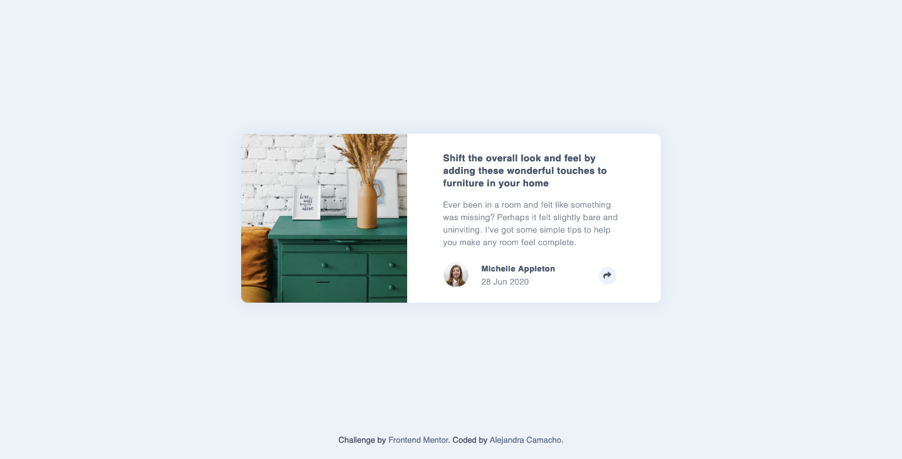
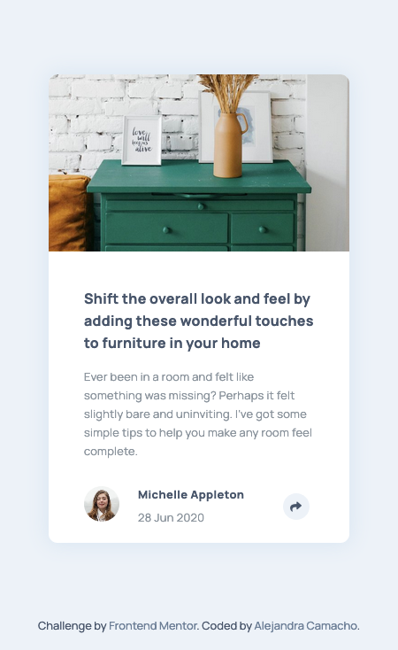

# Article-preview-component

## ✍🏻 Description
This is a challenge from [Frontend-Mentor](https://www.frontendmentor.io/challenges/article-preview-component-dYBN_pYFT).
The purpose of this challenge is to improve my skills with CSS and JS. 

## 🚀 Getting Started
Only you need download the project and open index.html. That's it.

## 🎨 Preview

You can see the live result here → [Article Preview Component](https://alexcamachogz.github.io/Article-preview-component/)

    
🖥 Desktop version

    
📱 Mobile version

## 👩🏻‍💻 Technologies
1. HTML
2. CSS
3. Stylus
4. JavaScript